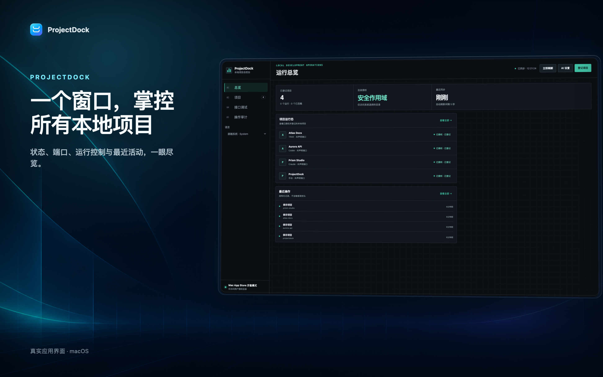
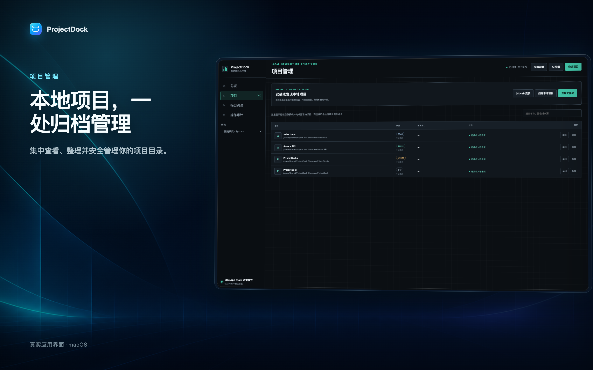
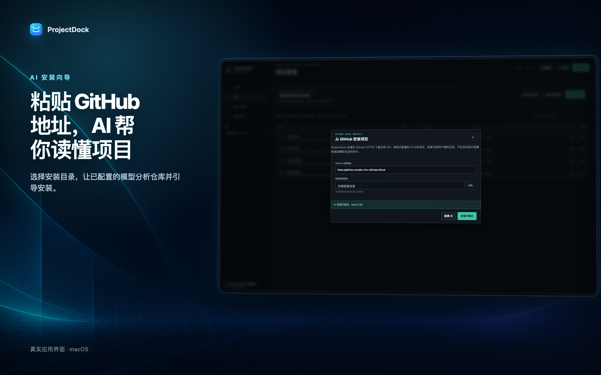
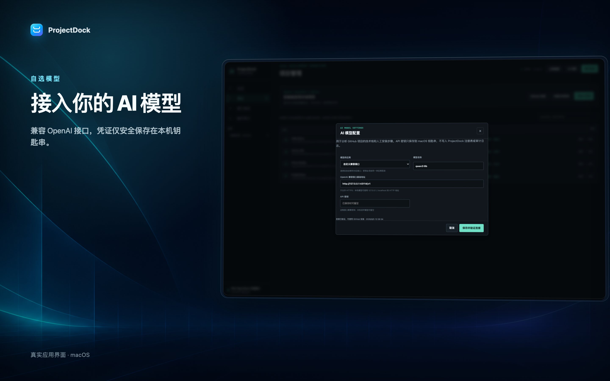
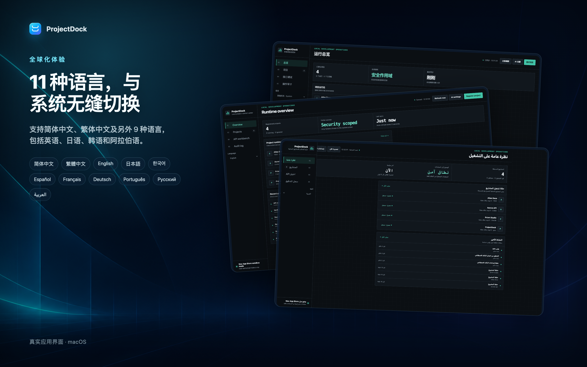
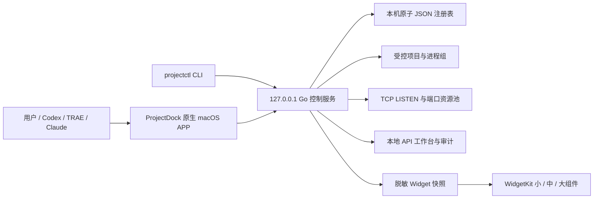

# ProjectDock

> 把散落在 Mac 各处的本地项目、端口、运行状态、GitHub 安装和 API 调试，收进一个原生项目控制台。

[](https://github.com/dw-zhu-si/ProjectDock/releases/latest)
[](https://github.com/dw-zhu-si/ProjectDock/actions/workflows/ci.yml)
[](https://github.com/dw-zhu-si/ProjectDock/releases/latest)
[](https://github.com/dw-zhu-si/ProjectDock/releases/latest)
[](#多语言)
[](LICENSE)



ProjectDock 是一款面向 macOS 本地开发工作流的原生项目管理工具。它帮助独立开发者和同时使用 Codex、TRAE、Claude、终端或 IDE 的用户，统一登记项目、观察端口、受控启停服务、安装 GitHub 项目、扫描本地目录、调试回环 API，并保留可追踪的操作记录。

它不是云端开发平台，也不会把你的项目目录集中上传到开发者服务器。应用内置 Go 控制服务、Web 控制台、本地注册表和 WidgetKit 桌面组件；所有核心数据默认保留在你的 Mac。

## 为什么需要 ProjectDock

本地项目一多，开发环境很容易变成这样：

- 项目散落在不同磁盘和目录，过一段时间就忘了入口。
- 多个开发工具各自启动服务，端口冲突发生后才开始排查。
- 终端窗口已经关闭，却不知道服务是否仍在运行、由谁启动。
- 从 GitHub 下载新项目后，还要手工阅读 README、识别技术栈和整理安装步骤。
- 删除项目时分不清是“从列表移除”还是“连本地文件一起卸载”。
- 测试本地接口还要来回切换浏览器、终端和 API 工具。

ProjectDock 把这些高频操作放到一个本机控制面板中，并为启动、停止、端口分配、目录删除和 AI 请求设置明确的安全边界。

## 产品亮点

### 一个窗口管理本地项目

- 统一展示已登记项目、运行状态、来源工具、启动能力和最近操作。
- 区分 ProjectDock 托管运行、外部运行、端口冲突、归档项目和“已登记但启动未接入”。
- 自动识别 `.projectdock.json`、`package.json`、Makefile、Docker Compose 和明确的启动脚本。
- 支持文件夹选择、Finder 拖放、CLI 同步和有界本地目录扫描。
- 不会为了“看起来可用”而猜测或自动执行不明确的项目命令。



### 粘贴 GitHub 地址，AI 辅助本地安装

在应用内粘贴标准 GitHub 仓库网址，选择安装父目录，即可启动安装流程：

1. ProjectDock 验证 GitHub URL、AI 可用状态和目标目录。
2. 下载项目并收集有限的 README 与常见依赖清单。
3. 使用已经验证通过的 AI 模型识别技术栈、启动入口和需要人工完成的准备步骤。
4. 将安装后的本地目录登记到 ProjectDock。

AI 只负责分析和说明，不执行模型生成的 Shell 命令。模型配置变化、连接验证失败或供应商/模型明显不匹配时，安装按钮会被禁用，服务端也会再次阻止安装。



### 扫描现有项目，安全决定如何删除

- 选择一个本地父目录，ProjectDock 会在深度和数量限制内发现可管理项目。
- 自动忽略依赖目录、构建产物、隐藏目录和符号链接，避免无边界全盘扫描。
- 删除时可以只移除 ProjectDock 登记，保留磁盘文件。
- 选择彻底卸载时，需要再次输入项目名称确认。
- 运行中项目、主目录、浅层目录、符号链接和 ProjectDock 数据目录受到保护。

### 端口、进程、API 和审计集中处理

- 查看真实 TCP LISTEN、项目持久端口分配和短时 TTL 预留。
- 启动前重新扫描真实监听，发现冲突时阻止启动，不自动终止未知进程。
- 受控记录 PID、运行令牌、退出状态和日志。
- 内置 GET、POST、PUT、PATCH、DELETE、HEAD 本地 API 工作台。
- 保存最近 500 条结构化操作审计，便于定位“谁在什么时候做了什么”。

### 关闭窗口后继续工作

关闭主窗口不会退出 ProjectDock。应用会隐藏 Dock 图标并继续在后台维护本地服务和桌面组件，项目状态变化也不会反复弹出主窗口。

侧栏提供“登录时自动启动”开关，默认关闭，由用户自行选择。需要真正退出时，使用菜单中的“退出 ProjectDock”或按 `Command-Q`。

### 原生桌面组件

ProjectDock 提供小号、中号和大号 WidgetKit 组件，用于查看项目数、运行状态、监听端口和持久分配。组件只读取 App Group 中的脱敏摘要，不接触项目路径、启动命令、PID、日志、API 密钥或接口调试内容。

## 下载安装

### 系统要求

- macOS 14 Sonoma 或更高版本
- Apple Silicon（arm64）

### 推荐：PKG 安装包

下载最新的 Apple 公证安装包：

**[下载 ProjectDock 0.10.1 PKG](https://github.com/dw-zhu-si/ProjectDock/releases/download/v0.10.1/ProjectDock-0.10.1-macos-arm64.pkg)**

双击 PKG，按系统安装向导完成安装，然后从“应用程序”目录打开 ProjectDock。安装包使用 Developer ID Installer 签名，已经通过 Apple 公证、票据装订和 Gatekeeper 验证。

### ZIP 免安装版本

**[下载 ProjectDock 0.10.1 ZIP](https://github.com/dw-zhu-si/ProjectDock/releases/download/v0.10.1/ProjectDock-0.10.1-macos-arm64.zip)**

解压后将 `ProjectDock.app` 拖入“应用程序”目录即可。ZIP 内的 APP 同样已经 Apple 公证，并移除了容易导致第三方解压工具破坏签名的 AppleDouble 条目。

### 独立 CLI

需要在终端或自动化工具中调用 `projectctl` 时，可下载独立 arm64 二进制：

```bash
mkdir -p "${HOME}/.local/bin"
curl -fL \
  "https://github.com/dw-zhu-si/ProjectDock/releases/download/v0.10.1/projectctl-0.10.1-darwin-arm64" \
  -o "${HOME}/.local/bin/projectctl"
chmod +x "${HOME}/.local/bin/projectctl"
projectctl version
projectctl doctor
```

所有发布附件及校验清单见 **[GitHub Releases](https://github.com/dw-zhu-si/ProjectDock/releases/latest)**：

| 文件 | 用途 |
|---|---|
| `ProjectDock-0.10.1-macos-arm64.pkg` | 推荐的 macOS 安装包 |
| `ProjectDock-0.10.1-macos-arm64.zip` | 可手动拖入“应用程序”的公证 APP |
| `projectctl-0.10.1-darwin-arm64` | Apple Silicon 独立 CLI |
| `SHA256SUMS` | 发布附件完整性校验 |

校验下载文件：

```bash
shasum -a 256 -c SHA256SUMS
```

## 第一次使用

1. 打开 ProjectDock，等待右上角显示已同步。
2. 在“项目”页面登记一个本地目录，或使用“扫描本地项目”批量发现项目。
3. 如需 GitHub AI 安装，先打开“AI 设置”。
4. 选择供应商预设或自定义 OpenAI 兼容接口，填写模型和 API 密钥。
5. 点击“保存并验证连接”；只有真实请求成功后才会启用 GitHub 安装。
6. 粘贴 GitHub 仓库网址、选择安装父目录，然后执行安装并登记。
7. 如需随登录在后台运行，在侧栏打开“登录时自动启动”。
8. 在 macOS 桌面组件库中搜索 `ProjectDock`，按需要添加组件。

## AI 模型配置

ProjectDock 支持以下 OpenAI 兼容入口：

- OpenAI
- 阿里云百炼标准 API
- 阿里云百炼 Coding Plan
- 本机模型服务
- 自定义 OpenAI 兼容接口

安全设计：

- API 密钥保存在 macOS 钥匙串，不写入项目注册表、日志或 GitHub 仓库。
- 设置接口只返回非敏感配置和验证状态，不回显密钥。
- 验证请求成功后才标记为可用；配置改变会立即让旧验证失效。
- AI 分析只读取有大小限制的 README 和常见依赖清单。
- 上游错误会转换为本地安全提示，不保存完整供应商响应正文。
- ProjectDock 不执行 AI 生成的安装命令，人工步骤仍由用户确认。



## 常用 CLI

### 登记当前项目

```bash
projectctl project sync --path "${PWD}" --source codex
```

同步只读取明确、无歧义的项目入口。需要手工指定生命周期时：

```bash
projectctl project add \
  --id my-project \
  --name "My Project" \
  --path "${PWD}" \
  --workdir web \
  --start "npm run dev" \
  --stop "npm run stop"
```

### 启动与停止

项目启停需要 ProjectDock APP 或 `projectctl serve` 保持运行。CLI 会把动作提交给常驻本地控制器，避免一次性命令退出后丢失运行状态。

```bash
projectctl project start my-project
projectctl project stop my-project
```

### 持久端口分配

```bash
projectctl port check 5173 --project my-project
projectctl port allocate 5173 --project my-project --owner codex
projectctl port check 5173 --project my-project
```

项目停止后会保留持久分配。确认项目以后不再使用该端口时再取消：

```bash
projectctl port unassign 5173 --project my-project
```

### 启动独立控制台

```bash
projectctl serve --listen 127.0.0.1:43110
```

浏览器会打开 `http://127.0.0.1:43110`。默认数据目录是：

```text
~/Library/Application Support/ProjectDock
```

测试或开发时可以隔离数据：

```bash
PROJECTDOCK_HOME="/绝对路径/projectdock-data" projectctl serve
```

## 两种发行渠道

ProjectDock 使用两个相互独立的发行渠道，避免为了 App Store 沙盒要求削弱 GitHub 完整版。

| 能力 | GitHub 完整版 | Mac App Store 沙盒版 |
|---|:---:|:---:|
| 本地项目登记与扫描 | ✅ | ✅ 用户授权目录 |
| GitHub + AI 安装 | ✅ 浅克隆 | ✅ 受限 HTTPS ZIP |
| 真实系统端口扫描 | ✅ | — |
| Shell 项目启停与日志 | ✅ | — |
| 仅移除项目登记 | ✅ | ✅ |
| 彻底删除项目目录 | ✅ 二次确认 | — |
| API 工作台与审计 | ✅ | ✅ |
| App Sandbox | — | ✅ |

GitHub 完整版已经发布。Mac App Store 版的沙盒能力、隐私清单、签名归档和宣传图片已经完成，但目前尚未在 App Store 正式上架。

## 多语言

界面支持跟随系统以及 11 种显式语言：

- 简体中文
- 繁體中文
- English
- 日本語
- 한국어
- Deutsch
- Français
- Español
- Português (Brasil)
- Русский
- العربية

当前每种语言均覆盖 217 组界面词条。语言选择会持久保存，并同步到原生菜单和桌面组件；阿拉伯语使用 RTL 布局，路径、URL、命令、端口和日志仍保持 LTR。



## 架构概览



核心模块：

| 目录 | 作用 |
|---|---|
| `cmd/projectctl/` | CLI、服务入口和版本握手 |
| `internal/projects/` | 项目登记、检测、扫描、同步与生命周期 |
| `internal/ports/` | 真实端口扫描、持久分配和临时预留 |
| `internal/installer/` | GitHub URL 校验与安全安装 |
| `internal/ai/` | AI 配置、钥匙串读取、验证与分析 |
| `internal/server/` | 回环 HTTP API、会话令牌和能力边界 |
| `native/` | AppKit/WKWebView 宿主、签名和发行脚本 |
| `ProjectDockWidgetExtension/` | WidgetKit 桌面组件 |
| `web/` | 内嵌本地控制台和 11 语言界面 |

更完整的设计和安全理由见 [架构与安全说明](docs/ARCHITECTURE.md)。

## 安全与隐私

ProjectDock 按“本地优先、最小权限、操作可追踪”设计：

- 服务只允许绑定 `127.0.0.1`、`localhost` 或 `::1`。
- 写操作需要启动期随机会话令牌和 JSON 请求。
- Host、CSP、点击劫持、DNS rebinding、SSRF 和敏感请求头都有服务端门禁。
- API 工作台只访问回环地址，禁止代理、账号信息 URL 和跨回环重定向。
- 未知进程只显示和阻断冲突，不自动强杀。
- 停止受管进程前会复核运行令牌、PID 和进程组。
- 注册表、AI 设置和审计文件使用受限权限与原子写入。
- Widget 只读取重新构造的脱敏白名单模型。
- 商店版目录访问依赖用户明确授权和安全作用域书签。

ProjectDock 不运营云端账号、广告或分析服务。可选 AI 请求直接发送到用户配置的模型服务，可选 GitHub 安装直接连接 GitHub。详情见：

- [隐私政策](https://pm.jcm99.com/apple/projectdock/privacy.html)
- [用户支持](https://pm.jcm99.com/apple/projectdock/support.html)
- [安全政策](SECURITY.md)

## 开发与验证

开发环境：

- Go 1.23
- Node.js 22（仅用于本地化与 JavaScript 检查）
- Xcode / macOS SDK
- macOS 14+，Apple Silicon

克隆并运行测试：

```bash
git clone https://github.com/dw-zhu-si/ProjectDock.git
cd ProjectDock

go test ./...
go test -race ./...
go vet ./...
node scripts/check-i18n.mjs

for file in web/js/*.js; do
  node --check "${file}"
done
```

构建无签名开发版本：

```bash
mkdir -p work/build
go build -o work/build/projectctl-darwin-arm64 ./cmd/projectctl

xcodebuild \
  -project ProjectDock.xcodeproj \
  -scheme ProjectDock \
  -configuration Release \
  CODE_SIGNING_ALLOWED=NO \
  build
```

签名、公证和 App Store 导出需要开发者自己的 Apple Developer 账户、证书与钥匙串配置；仓库不包含任何发布凭证。

## 当前验证状态

0.10.1 已完成：

- Go 单元测试、竞态测试和静态检查。
- 11 种语言 217/217 完整性检查和 JavaScript 语法检查。
- GitHub 完整版与 App Store 沙盒版两套 Xcode 构建。
- Developer ID APP 深度签名、Apple 公证、票据装订和 Gatekeeper。
- Developer ID Installer PKG 签名、公证、票据装订和 Gatekeeper。
- 真实回环健康、项目快照、端口接口、API 和 Widget 快照探针。
- GitHub Actions CI 与 GitHub Pages 部署。
- 可跟踪源码敏感信息扫描。

仍需外部或人工环境完成的边界：

- Mac App Store 尚未正式上架。
- Finder 跨窗口物理拖放保留人工验收。
- 尚未发布 Intel `x86_64` 构建。
- Linux 只作为未来可能的 CLI 目标，不属于当前正式支持平台。

## 常见问题

### 关闭窗口后为什么应用还在运行？

这是设计行为。ProjectDock 需要继续维护本地控制服务、项目状态和桌面组件。使用 `Command-Q` 才会真正退出。

### 为什么有些项目只能登记，不能启动？

ProjectDock 只接受明确、可审计的启动入口。检测不到唯一入口时会显示“启动未接入”，不会猜测命令。你可以在项目配置中人工补充工作目录、启动和停止命令。

### 为什么 GitHub 安装按钮不可用？

必须先在“AI 设置”中保存配置并完成真实连接验证。API 密钥无效、模型不存在、接口不兼容或配置改变后，安装会被阻止。

### 端口分配等于系统已经占用端口吗？

不是。持久分配是开发工具之间的协作锁，真实占用仍以 TCP LISTEN 为准。ProjectDock 会在启动前再次扫描真实监听。

### 删除 ProjectDock 会同时删除我的项目吗？

不会。删除应用本身不等于删除项目目录。应用内“彻底卸载项目”也需要选择该方式并输入项目名二次确认。

## 参与贡献

欢迎提交缺陷报告、功能建议和聚焦的 Pull Request。提交前请阅读：

- [贡献指南](CONTRIBUTING.md)
- [行为准则](CODE_OF_CONDUCT.md)
- [安全报告方式](SECURITY.md)

新增界面文案时必须同步全部语言。涉及命令执行、项目删除、GitHub 安装、AI 请求或目录访问的改动，需要同时提供安全失败测试。

## 许可证

ProjectDock 以 [Apache License 2.0](LICENSE) 开源。

ProjectDock 是 Zhu Si 的个人独立项目，与任何任职单位无关。
